# EasyComp
EasyComp is a competition management website that helps you create, record and announce competitions digitally, and manage competition administration all in one place.

EasyComp is a Fullstack Web Application for managing Ciputra University's Competitions. EasyComp was made with Laravel and Tailwind CSS. EasyComp is my final project that I made during my final semester in university. 

Repository Link: https://github.com/anthonytheon/EasyComp  
Publication: This web application is hosted at [Heroku](http://easycomp.herokuapp.com/)

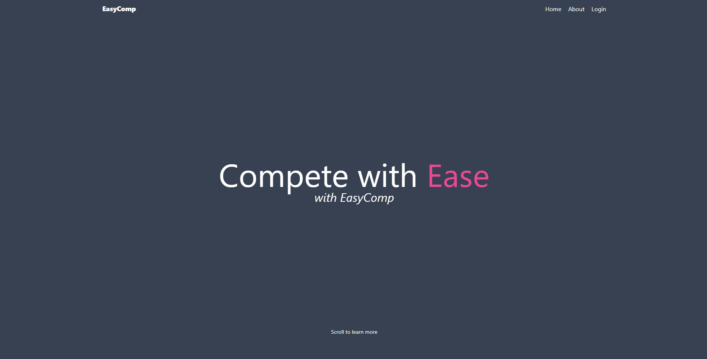&nbsp;&nbsp;&nbsp;&nbsp;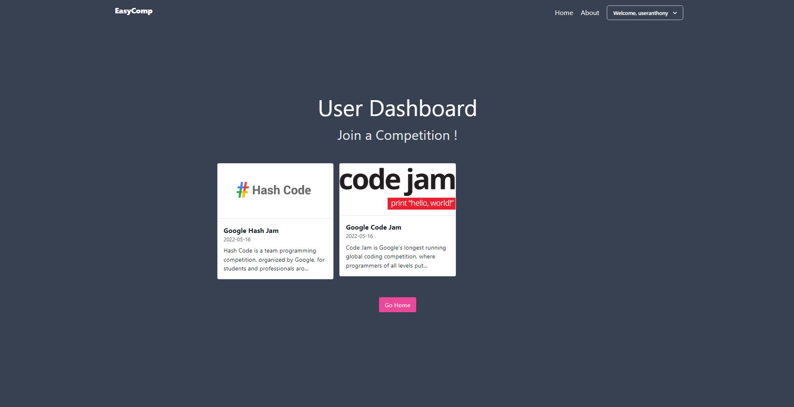

# UC Repository
UC Repository is a back-end web application for Ciputra University students to self upload their Final Project. UC Repository was made with Laravel and Tailwind CSS
 

[User Manual Guide](https://docs.google.com/document/d/13DJUJlODuopkFKF4S8H3O_zjqQCM-5Ng4nXvNE5vUEI/edit?usp=sharing)
 
[ER Diagram](https://imgur.com/a/PM3FK8O)
 
[SOA / Workflow](https://imgur.com/a/MBqXPSL)
 

Repository Link: https://github.com/anthonytheon/UC-Repository  
Publication: This application was made locally

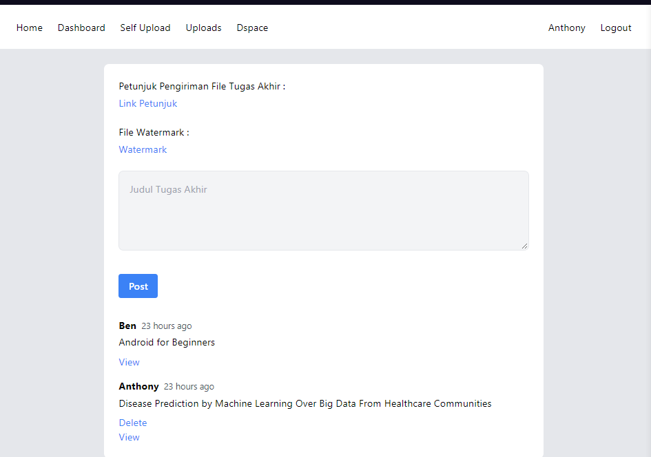&nbsp;&nbsp;&nbsp;&nbsp;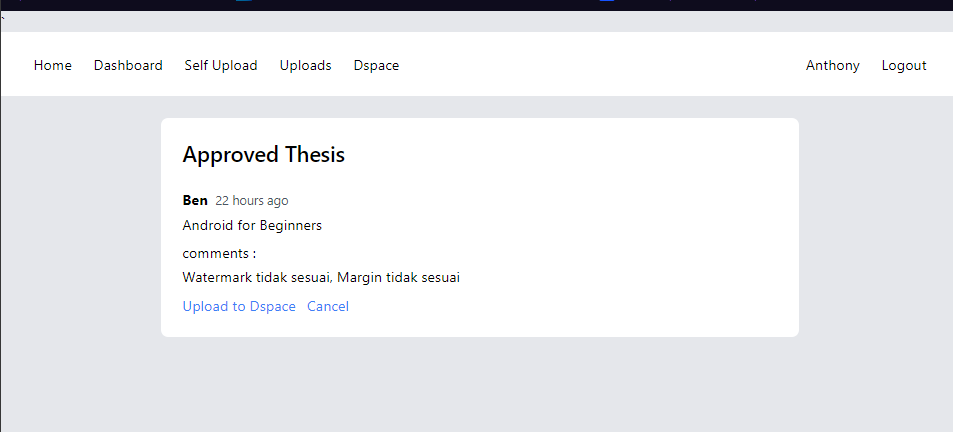

# Smart Parking
Smart Parking is a microcontroller that can be monitored directly offline or online via an existing smartphone device.

With this smart parking prototype, it can identify available parking slots using the Blynk App so that it can provide information to drivers who want to park in a building.

Smartphone devices are used to view existing parking slots and lock the parking slot desired by drivers who want to park to make it easier for drivers who want to park their vehicles.

[Microcontrollers & Smart Parking Board](https://imgur.com/a/1cduzCv)
 
[Smart Parking Schematic](https://imgur.com/a/HsgIZ2A)
 
[Smart Parking Fritzing](https://imgur.com/a/kS5k3Zf)
 
[Smart Parking's Blynk App Interface](https://imgur.com/a/78PjSTw)
 
 
[Video Demo](https://youtu.be/zug8zL08NJg)

Repository Link: https://github.com/anthonytheon/SmartParking  
Publication: This hardware / software was made locally

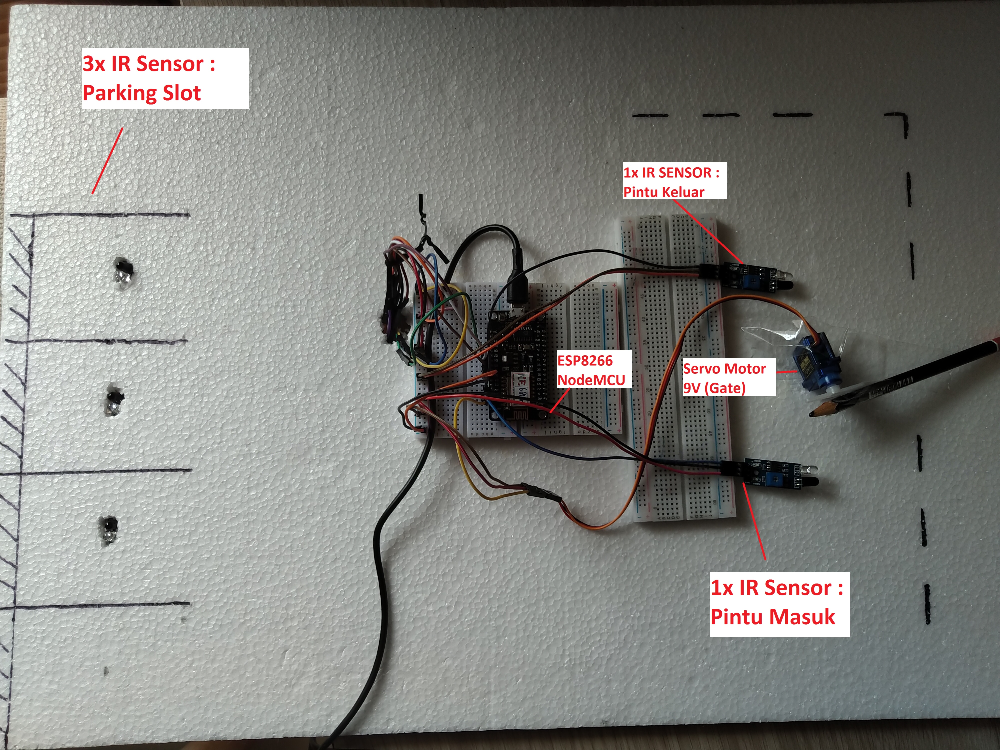&nbsp;&nbsp;&nbsp;&nbsp;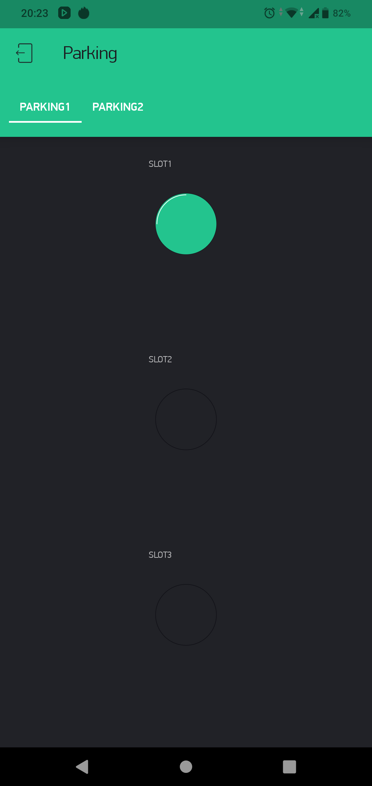

# Diabetes' Diagnostic Test Results
This project was made to learn more about machine learning during my 3rd year of University. This project is an exploratory Data Analysis and Classification Model for Diabetes' Diagnostic Test Results. 

Repository Link: https://github.com/anthonytheon/diagnostic-test-result-machine-learning  
Publication: [Kaggle](https://www.kaggle.com/anthonytheon/diagnostic-test-results-machine-learning)

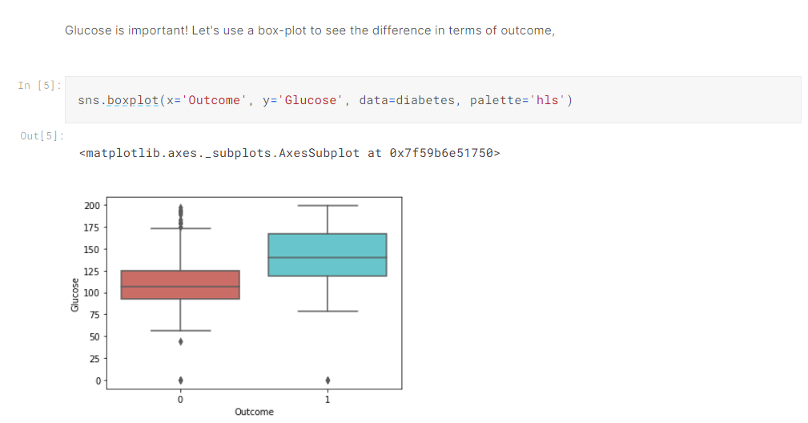&nbsp;&nbsp;&nbsp;&nbsp;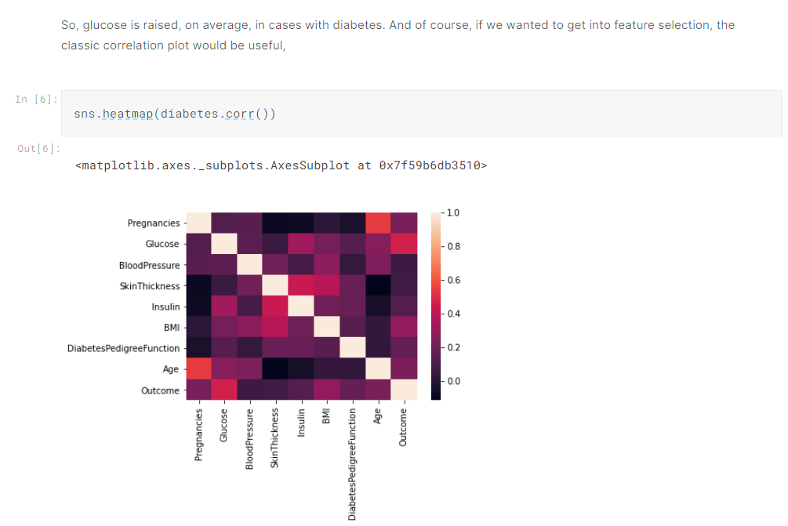

# Lite Games
Lite Games is a "mental health" themed indie RPG game where you can create your own story through dialogue choices in the game. The game features relatively few gameplay mechanics, with the player controlling a character they've made and exploring a narrative.

Repository Link: Not Available
 
Publication: Not Available

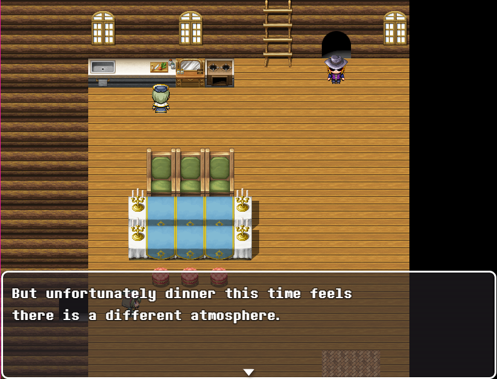&nbsp;&nbsp;&nbsp;&nbsp;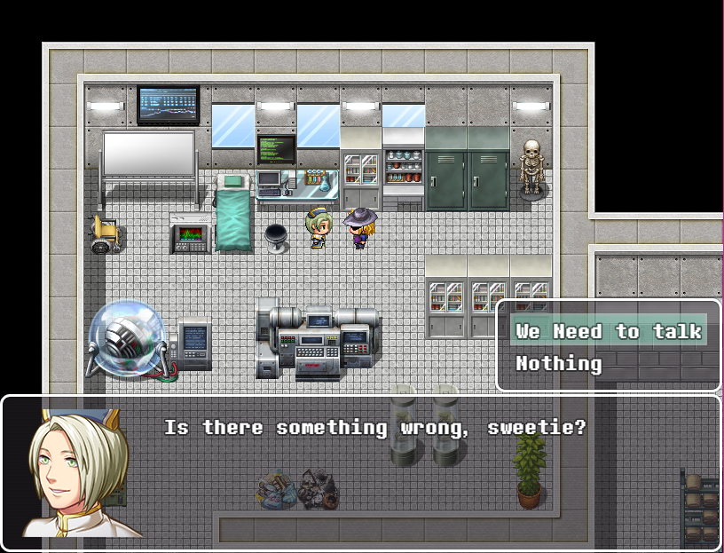

# Indo Mega Vision Event
Indo Mega Vision is a company and a computer hardware manufacturer. Indo Mega Vision held an event in Batam, and the purpose of this event is to promote or advertise their newest and most popular products. One of my projects while I was a software engineer at Indo Mega Vision is to create a website to advertise their products digitally and easily just by scanning a barcode. The purpose of this barcode is to let people see a web based advertisement or download the brochure through their phone during the event.

Repository Link: Not Available
 
Publication: https://imv.co.id/event

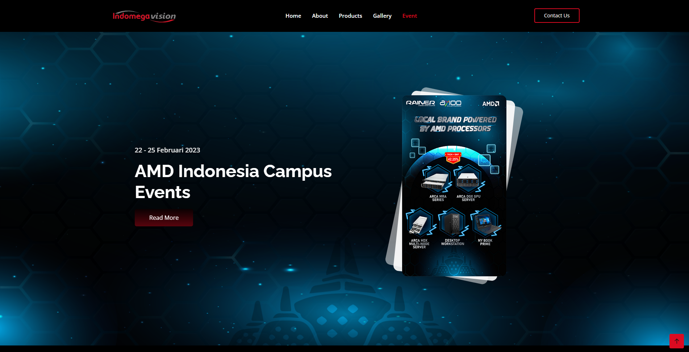&nbsp;&nbsp;&nbsp;&nbsp;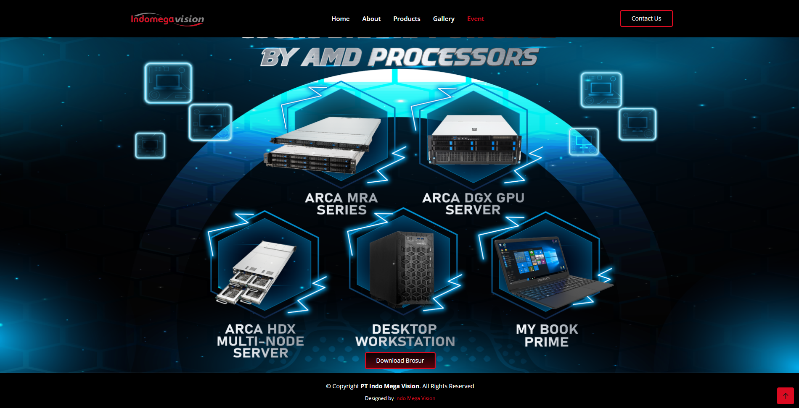

# Indo Mega Vision Reseller
Indo Mega Vision is a company and a computer hardware manufacturer. Indo Mega Vision held an event in Batam, and the purpose of this event is to promote or advertise their newest and most popular products. One of my projects while I was a software engineer at Indo Mega Vision is to create a website. This website has a form that verify data and register reseller who wants to be a Indo Mega Vision Reseller.

Repository Link: Not Available
 
Publication: https://imv.co.id/reseller

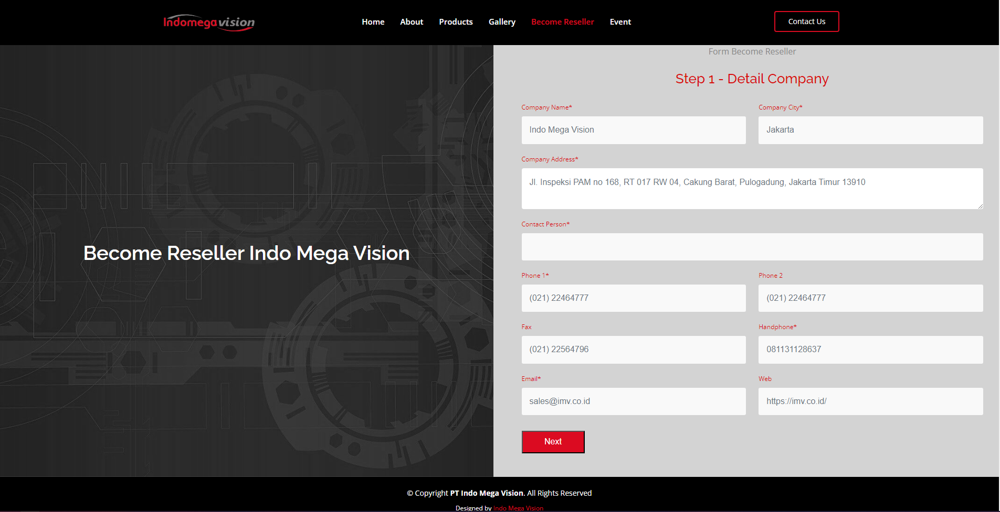

